## 育成状況

<LinkOpenGraph url="https://atarukodaka.github.io/game/umamusume/umamusume/"/>

### 殿堂入り
とりあえずこんな感じ(2021-03-18)：

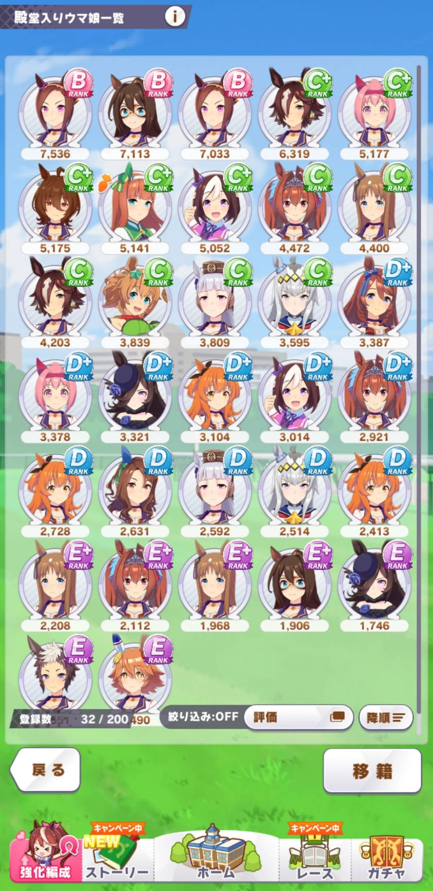

#### チーム編成

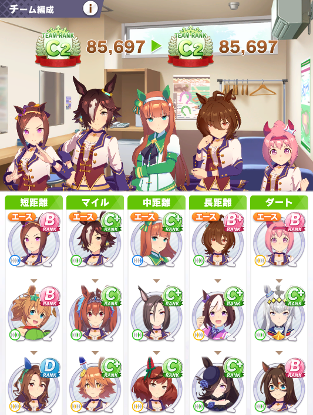

## 因子持ち

- ゴルシB+：賢さ★２ (フレオペラオー：スピード★３）
- ゴルシC：根性★２ (ライスC+：賢さ★２）
- グラスC：賢さ★２（フレテイオー：パワー★３）
- ライアンC+：賢さ★２（フレクリーク：スピード★３）
- ライスC+：賢さ★２
- スペC+：スタミナ★２（ダスカB：スタミナ★２＋オグリD：パワー★２）
- ダスカB：スタミナ★２（フレテイオーパワー★３＋ライスC+：賢さ★２）
- ネイチャC+：スピード★２

## 殿堂入りウマ娘
### スズカ
スズカSCCDC+
押切準備から先頭譲らずが必勝コース。

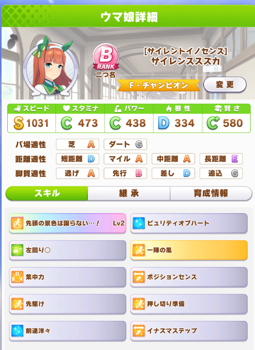

### ゴルシ
ゴルシB+B+C+D+B。ファイナル決勝制覇。出遅れから序盤直線スキル暴発でどうかと思ったが無事制覇。
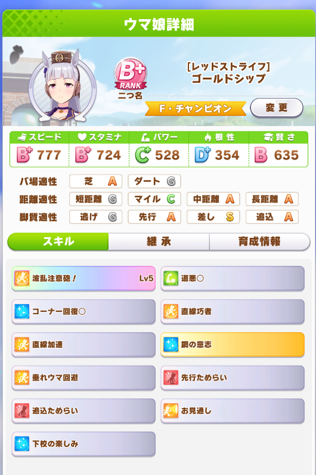

### アグネスタキオン
ファイナルまで制覇。スピードはAまで。長距離Sがついた。
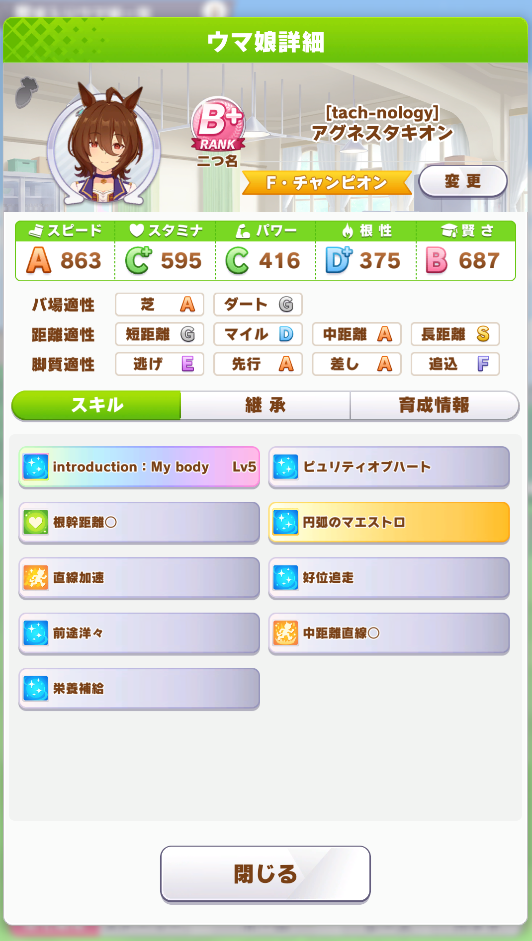

### タイキシャトル
ひたすら短距離スピード。しかしファイナルはマイル。決勝は最後の時計使ってぎり制覇。

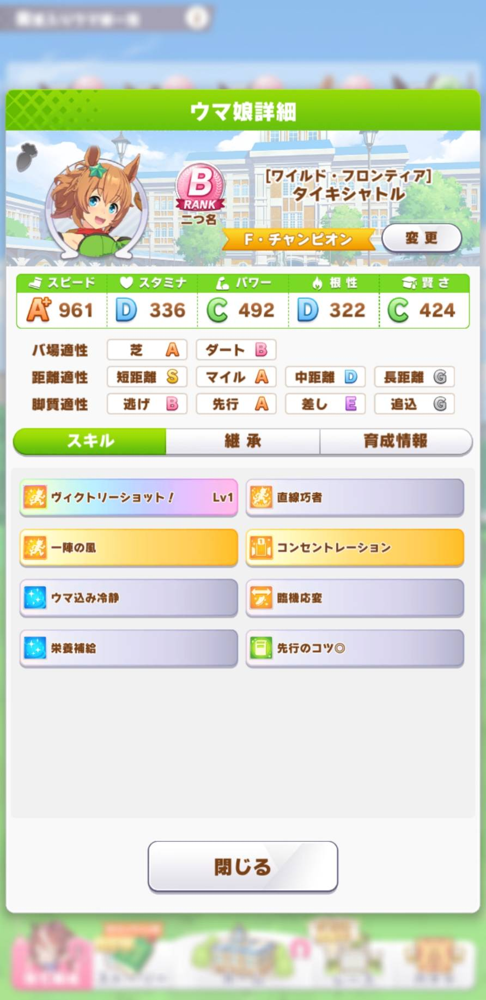

### エルコンドルパサー
アニメ見たら結構活躍してたのでプレイ。継承で先行Sとれたのでそのスキルを重点的に。
ファイナル決勝まで進むも敗着。

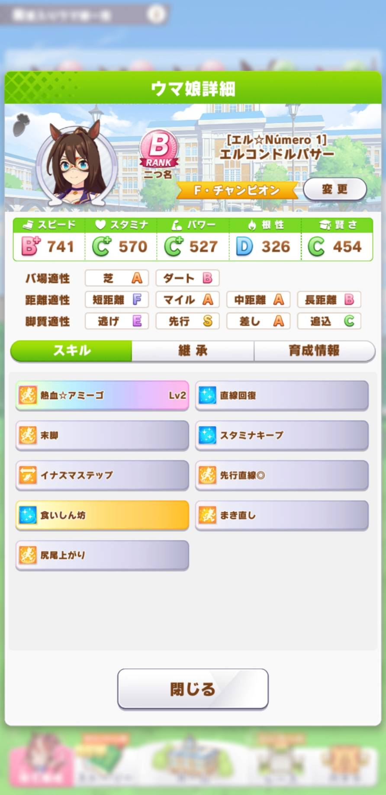

### ウォッカ
スピードスタミナ先行でファイナルまで。決勝は敗退。
フレのトウカイテイオーSSRの友情トレが頻出してくれた。
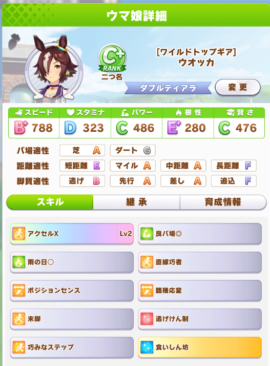

### ダイワスカーレット
有馬まで行ったが長距離で勝てず。。。

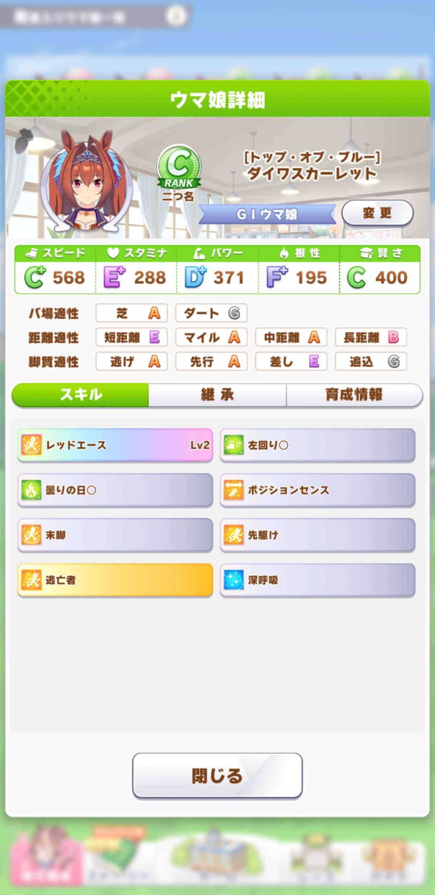

### サクラバクシンオー☆１
URAファイナル制覇。
とにかくスピード命。休みの代わりに勉強かお出かけ。

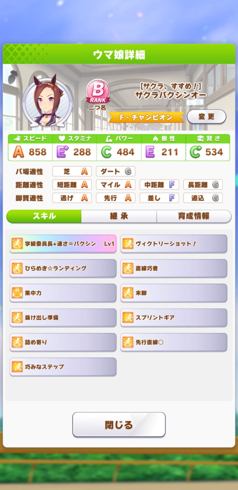

### スペシャルウィーク☆３
スタミナ・パワー中心に育てて有馬記念優勝。URAファイナルは予選にて敗退。
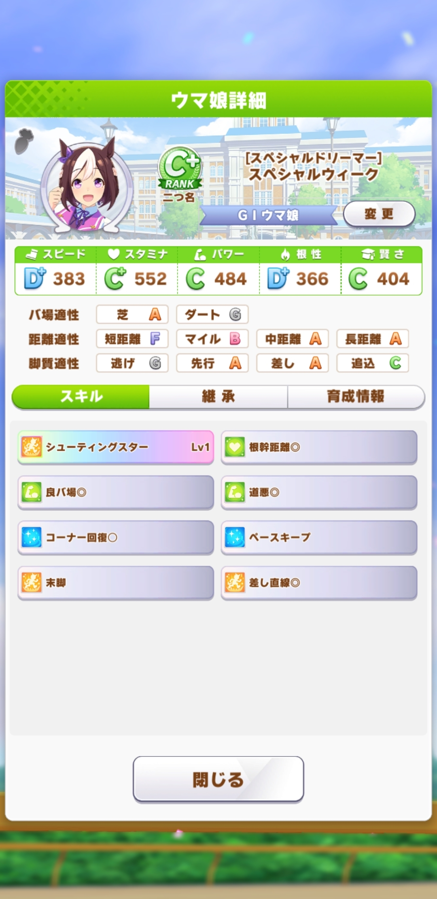

### ハルウララ☆１
唯一のダート得意。有馬敗着。。。ごめんよ。。。
URAファイナル進出も予選で敗退。

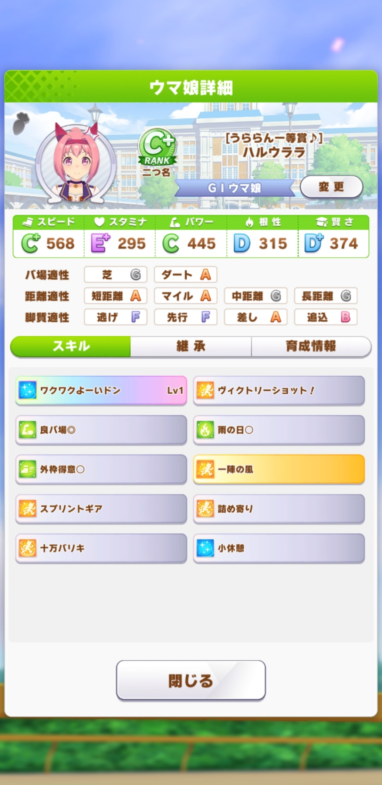

## サポート
### SSRスピード スペシャルウィーク
イベント報酬。

末脚

### SSRトーカイテイオー

### SSRスタミナ ゴルシ
追い抜き系

### SSRマックイーン

### SSRライスシャワー

## 参考サイト
<LinkOpenGraph url="https://umamusume.jp/"/>
<LinkOpenGraph url="https://eruakudiary.hatenablog.com/entry/2021/02/27/220827"/>
<LinkOpenGraph url="https://goziline.com/archives/43607"/>
<LinkOpenGraph url="https://note.com/renekuroi/n/nfcec96121b63"/>
<LinkOpenGraph url="https://wikiwiki.jp/sppenpen/"/>
<LinkOpenGraph url="https://kusocial.hatenablog.com/entry/2021/03/09/212325"/>
<LinkOpenGraph url="https://irohanipotato.com/umamusume_all_b/"/>

<LinkOpenGraph url="https://anond.hatelabo.jp/20210316164637"/>
<LinkOpenGraph url="https://wikiwiki.jp/vip_umamusu/"/>