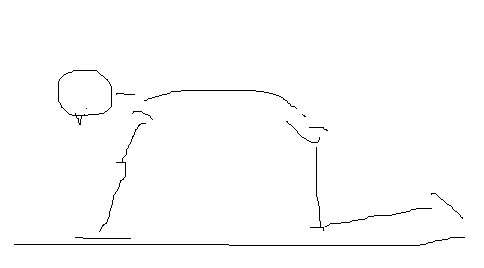
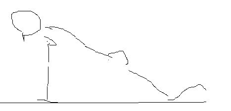
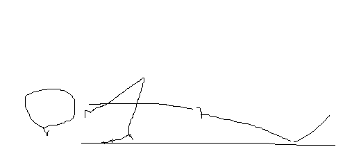

## やり方
みなさんおなじみ腕立て伏せ。誰しも一度はやったことがあるのでは。
だがその割に「正しいフォーム」で行うのはなかなか難しい。
手軽にできるように見えて、実は初心者向きではなく、
狙ったところに効かせるにはそれなりのテクニックが必要だし、
下手に無理にやると腕や肩を痛めてしまう。

### 体勢の作り方

まず四つん這いになってお馬さんのポーズを取ります。子供が上に乗っても大丈夫なように手幅足幅は肩幅より若干広めに取ります。
手のひらは少し開いて10時10分くらいに。そうするとおよそ前から見ても横からみても**台形**になってると思います。

そこから重心を前に移動させ、肩が手のひらの上に乗るくらいに持ってきて、頭から首・背中・膝まで一直線になるようにします。
ちょうど肩・手・膝が**直角三角形**を描くような姿勢になります。

### ダウン・アップ

そこから**脇を開かず**、体は一直線を保ったまま胸を前方においていくような形で腕を畳み、地面に顔が着くくらいまでおろし、同様に元の位置まで上げる。

体を降ろすときに脇が開いてしまって肘が外側に出てしまうと、肩や肘を痛める原因になるので、そこは気を付けること。そのまま腕を平行に畳むようにするとやりやすい。

下がるときに腕や肩でこらえるのではなく**胸で受ける**ようにすると大胸筋に効いてくる。これは慣れ。

### フル・プッシュアップへ
ここまで膝をついたままの「ニーリング・プッシュアップ」だが、そこそこ効いてるはず。
**20repx3セットで無理なくできるようになったら**、つま先で支えるフル・プッシュアップに移行する。降りるときは、つま先を押し体を前方に押すようにするとよい。

### テンポ・呼吸
息を吸いながら**２秒**で下がり、吐きながら**２秒**で上がるのを基本とし、

- 片道４秒かけるスロートレーニング
- 上がるときは一気に1秒かけずに上がる爆発的トレーニング
- ボトムで１０秒止める静止トレーニング

などのバリエーションを取るとよい。

## 注意点
`youtube:https://www.youtube.com/watch?v=ESLamF393as`
`youtube:https://www.youtube.com/watch?v=4BXyeGvDN7c`

### 手幅をワイドに取りすぎない
よく「ワイドは大胸筋に効く」という説明がなされることがあるが、これは誤り。
脇が開いてしまうと肩や肘を痛める危険性が増すので非推奨。

### 肩甲骨を寄せる
これもよく言われてます。肩をベンチ台に固定できるベンチプレスなら容易にできますが、体も一緒に動かすプッシュアップの場合はやりにくいですし、
下手に寄せようとすると肩がすくんでこれまた関節を痛めます。
自然にまっすぐ体軸を取って、力を胸で受けるよう意識するほうがよいでしょう。

### プッシュアップバーなどで深くストレッチポジションを取る
これも肩がすくんでしまうと関節を痛めやすいので、慣れないうちは非推奨。
ただ床に手を置くと痛い場合は、プッシュアップバーを使ってつかむ分には問題ない。

## 解説動画
### なかやまきんにくんの解説動画：
`youtube:https://www.youtube.com/watch?v=k4fsFKCp5iU`

### トレーナーゆうじの解説動画：
`youtube:https://www.youtube.com/watch?v=jUzbOjswiRg`

### バズーカ岡田の解説動画：
`youtube:https://www.youtube.com/watch?v=JDUi48AEZ8k`

