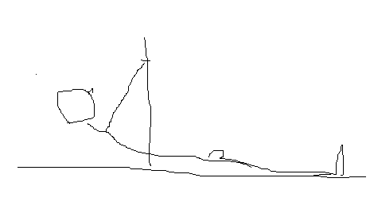
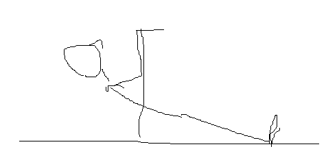

## まーず出来ない
懸垂は、いきなりやってもまず出来ないと思った方がよい。若い頃しっかりスポーツしてて今も継続的に運動している標準以下体系の人じゃないとまずムリゲー。
いきなりやっても大抵上がらないので、あまり意気消沈する必要はない。

## 必要器具
引く系は、さすがにぶら下がる器具が必要。椅子や机でも代用出来なくもないが、危ないので非推奨。

部屋にある程度スペースが取れるなら（二畳程度）懸垂台を買ってしまった方がよい。WASAI BS312を使ってるyoutuberが多いようだ（2021/3現在品切れ中）。

- [家でマッスルアップもできる鉄棒買いました！商品レビュー的な。\[WASAI BS312\]\[カリステニクス･自重トレ\] \- YouTube](https://www.youtube.com/watch?v=wOoNlmt7hzY&t=420s)
- [懸垂マシンはこれ一択です\!\!最高の家トレ器具に出会ってしまいました【開封からレビューまで】 \- YouTube](https://www.youtube.com/watch?v=Ci-3JwrAXVA)
- [English sub\.【筋トレ女子】新しく購入した懸垂台のレビュー＆エアウォークの練習！【My new pull up stand review&Air walk pull ups\!】 \- YouTube](https://www.youtube.com/watch?v=6FrBKP7EdS4&t=512s)

スペースがない・家族の了解が得られない・倒れてくると怖いなどの理由で導入が難しければ、ディップススタンドがよい。そんなに場所を取らずに斜め懸垂からフロントレバー、プランシェ、ディップス、L字レッグレイズなど多種のワークアウト種目が出来る。下手にガタガタの安い懸垂台買うぐらいならディップススタンドのほうがいいまである。

さすがにフルのプルアップは出来ないので、時々公園の高鉄棒や雲梯で懸垂するなどで補完するように。

## ディップススタンドでプルトレーニング
### 斜め懸垂
インバーテッド・ロウ、ホリゾンタル・プルなどとも呼ばれる。

`youtube:https://www.youtube.com/watch?v=JrAQSMgxGd0`

だがこれ、背筋を使うのが結構難しく、いろいろ問題がある。まず体を引き上げようと腕の力を使ってしまいがち。バーになんとか近づけようと脇が開き肩がすくんでしまったりもする。また公園の鉄棒でやると、下が砂利で足が滑ってしまいやりづらい。腕の力を使う分には上腕二頭筋のトレーニングになるのでいいのだが、肩をすくめる癖がついてしまうと関節を痛めるのでよろしくない。

なので、体を引き起こそうとするのではなく、**腕を下ろす伸展動作のみ行う**。フローリングの床に靴下を履き滑るようにしておき、斜め懸垂開始の体勢を取る。

そこから腕を引くのではなく、肘を腰に近づけるように腕を下に降ろす。そうすると自然と足がバーに近づき体が起きてくる。
肘が腰につき九十度くらいの角度になったら元に戻る動作に移る。

この動きだと、伸展動作に集中できほぼ広背筋に負荷が乗る。