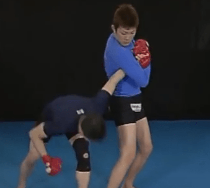

## ディップスは危険？
基本的にディップスは<Asc256>非推奨</Asc256>です。なぜなら

- 間違ったフォームでやると**肩を痛める**
- 正しいフォームでやってもやっぱり**肩を痛めがち**

から。

`youtube:https://www.youtube.com/watch?v=2Rsw1XQDyc4`

体の構造上、腕で支えたまま体を下げると肩が残りすくんだ状態になりやすい。そこから肘を曲げると
どうしても肩を巻き込んでしまい、脇固めをくらってる形になってしまう。

しっかり肩甲骨を寄せ肩を下げ胸を開き上体を前傾させればある程度防げるが、
それでもやっぱり負担は小さくはないし、そのフォームを取るには結構な筋力と練習が必要になる。

### ホロウボディ保持
それでもあえてやるというのなら、胸は開かずに含み肩を前に出すようにホロウボディを取る形を推奨する：

`youtube:https://www.youtube.com/watch?v=iTGgReRdcl0`
`youtube:https://www.youtube.com/watch?v=OTbDTCQpejM`

これであれば過度な負担は避けられるが、最初はかならず足をつき補助つきでやること。

### 足をかけて前傾を保持
後ろに膝程度の高さの椅子を置き、そこに足の甲を乗せることにより前傾を保つ。
ディップスというより、深めに沈むプッシュアップ。
先にボトムを取りしっかり胸が開き肩が下がってるかを確認してから始めたほうがよい。
トップから降りてくると、肩を巻いたりしがち。

## 代替トレーニング
### 吊り輪プッシュアップ
ディップススタンドを使うのであれば、吊り輪を下げてプッシュアップするのもよい。
吊り輪がなければベルトを輪っかにしてタオルをあて代用できる。

### ストレッチド・デクライン・プッシュアップ
もう一度、プッシュアップをやり直してほしい。
ストレッチがほしいならバーを使おう。思った以上にフォームによってかかる部位・負荷の強さが変わってくるはずだ。ディップスバーを斜めに倒して持ち手とし、
足を椅子にかけて高くしデクラインにすれば、
下手にディップスをやる以上の効果と安全性が得られるはずだ。

### ディップス参考動画
park fitness
`youtube:https://www.youtube.com/watch?v=A_4fatY9s5o`

katochan
`youtube:https://www.youtube.com/watch?v=Rt605mGlmLg&t=10s`
