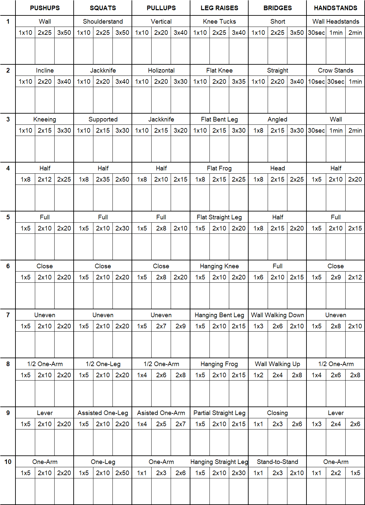

## プリズナートレーニングとは

### 概要
<LinkOpenGraph url="https://www.amazon.co.jp/dp/B0746H85JW" />

この本で提唱されている、自重トレーニングのみで体を鍛える方法論。
著者が元「囚人」とのことで、「なにもない」牢獄で体を鍛えるメソッドを編み出している。
内容的には、腕立て伏せ・懸垂・スクワットなど標準的なものだが、
レベル１～１０に段階的に分けて徐々に難易度をあげる方法と、
「少しでも弱みを見せれば**『喰われる』**弱肉強食の監獄という極限状態での鍛錬」
というストーリー付けがなかなか厨二病なところをくすぐってくる。
表紙もインパクトに溢れる。

ウェイトなどの「重り」を動かすのではなく、自分の体をコントロールすることを主眼とする。

### ビッグ６

行うトレーニングは以下の６つの種目系統。　

- **プッシュアップ**（腕立て伏せ）
- **プルアップ**（懸垂）
- **スクワット**
- **レッグレイズ（脚上げ）**
- **ブリッジ**
- **ハンドスタンド・プッシュアップ**（逆立ち腕立て）

の６系統の種目群に分けられ、上半身・下半身、前面・背面・押す・引くなどの観点から
体全体の動きがカバーされている。そしてそれぞれレベル１ー１０まで難易度に分けられている。
例えば腕立て伏せなら：

<Callout>
1:壁押し⇒ 2:斜め ⇒ 3:膝立ち ⇒ 4:ハーフ ⇒ 5:フル ⇒
6:クローズ ⇒ 7:不均衡  ⇒8:半片手 ⇒ 9:レバー ⇒ 10:片手
</Callout>

と段々難しくなっていく。というか最後のほうまず無理だろ。

また、それぞれ何回何セットできるかによって初級者・中級者・上級者に分けられ、
次のレベルに進むのは上級者をクリアしてからとする。

種目の詳細はこちらで：
<LinkOpenGraph url="https://okiresi.com/archives/29378688.html"/>

一覧表はこんな感じ：（[PDF版](/assets/cc_table.pdf)）

### 必要器具
ダンベル・バーベルなどの一般的なウェイト器具は必要としないが、
プルアップでは引き上げ動作があるので鉄棒や懸垂台が必要になる。
近くの公園の高鉄棒かチンスタやディップススタンドなどを用意。

後半でバスケットボールなどが出てくるが、家にあるボールや台、百均のバランスボールなどで代用できるだろう。

## いいところ

### ジム通いやダンベル・バーベルなどのウェイト器具が不要
自重トレ一般に言えることだが、重たく邪魔になるダンベルやベンチなどに
部屋が占拠されることがない。
チンスタはたしかに邪魔だが洗濯物干しになるし、ディップススタンド程度なら隅においておけば邪魔にならない。

### 平易な難易度から始められる
最初のころの種目はしごく簡単で、よっぽどケガしてるとか痛めてるのでない限り、誰でもその場で始められる。
上記のプッシュアップ Lv1 などは、壁の前に立って手をついての「腕立て」で、
これはさすがに出来るだろう。

そこから徐々に難易度が上がり複雑になってくので、単純にキロ数が上がるウェイトとは
また違ったモチベーションがある。

### 腱や関節に配慮
ウェイトトレーニングで痛めるのは、大体筋肉ではなく、関節や腱。
筋肉は重い荷重に耐えられても、関節が先に痛めつけられて根を上げる。
とかくウェイトだと重量に傾倒してしまい、ケガにリスクが高くなることが多い。

その点この手法では、まず関節・腱を慣らすことから始める。
Lv1などは軽負荷で誰でもできるほど簡単ではあるが、
この過程に最低でも２週間はかけて関節を慣らすよう指導している。
最大負荷も自体重であり、100キロを超えるような重量で腰や膝を痛めけることはない
（よっぽどの巨漢は除く）。

## ダメなところ

### 種目系統によって難易度の差がありすぎる
プッシュアップのLv5、通常の腕立て伏せなら、
そこそこの標準体型であれば５回から１０回くらいはできると思う。
が、プルアップLv5、懸垂は、ある程度運動してる人じゃないと、
まーず１回も出来ない。同じレベル５といっても系統によって難易度の差が非常に大きい。
というかプルLv2のホリゾンタルプルの時点でかなりキツイ。

### 筋力ではなく柔軟性の問題でできない
スクワットはなぜかLv1が「ショルダースタンド・スクワット」、
背倒立というやつだが、これは体が十分柔らかくないと出来ない。
つかなんでこれがスクワット？？

またスクワットの後半レベルは片足でのピストルスクワットになるが、
これも足首の柔軟性がないと後ろに倒れてしまい出来ない。

### レベル後半は超人すぎる
片手逆立ちプッシュアップとか、それ曲芸の域だろ。常人ではまず無理。
プッシュアップ、プルアップなどの後半は片手に移行していくが、
アンイーブンやアーチャーはどうにかなるにせよ、
完全な片手はあまりにムリゲーなので、
素直に荷重やスロートレーニング、ハイレプス、ゴムバンドなどを導入したほうがいいと思う。

## 自分なりのアレンジを
別に牢獄にいるわけでもないので、無理に「自重」にこだわることもないと思う。
レベル中盤までいったら、それ移行は無理にこの過程に縛られず、ウェイトトレーニングを併用したり加重したりと、自分の力量・知識量に合わせてアレンジしていけばいい。

最初の簡単なレベルをおろそかにせず時間をかけろ！というのも正論だけど、
正直最初のほうは簡単すぎて面白くないんで、出来るとこまでとりあえずやってみてもいいと思う。
後になって、やっぱりこれ最初の方必要だわ、と気づいたらまた戻ればいいし、
飽きてやらなくなるよか、やって戻る方がよい。それを含めてのトレーニング過程かなと。

かくいう私も、数か月これにそってトレーニングを進めて、Lv5についたくらいで
腕立て伏せ各種、斜め懸垂（レバー）、（ブルガリアン）スクワットの三本柱に移行しました。

## 参考サイト
<LinkOpenGraph url="https://www.newsweekjapan.jp/stories/carrier/2018/11/3-119.php"/>
<LinkOpenGraph url="https://saigetsuan.com/prisoner-training-1year.html"/>
<LinkOpenGraph url="https://okiresi.com/archives/29378688.html"/>
